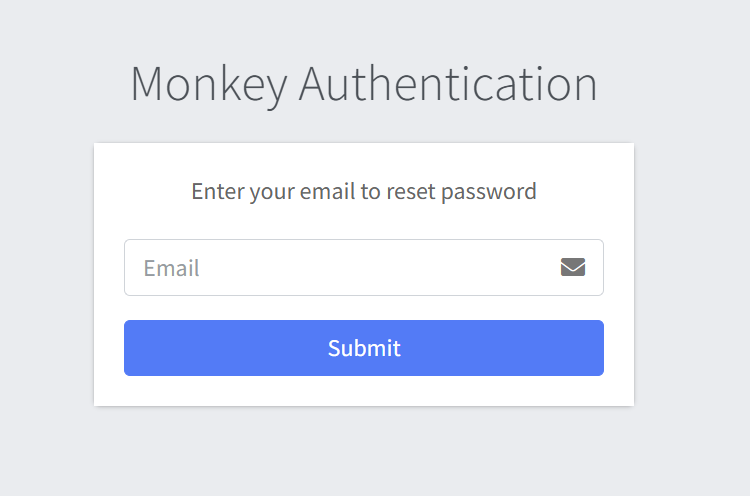
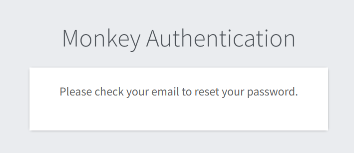
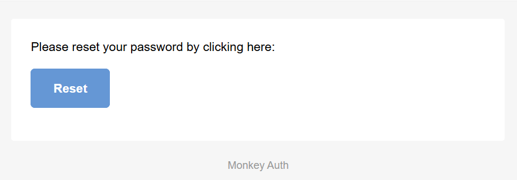
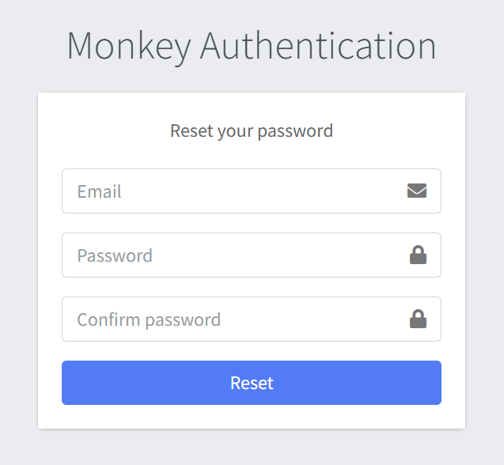
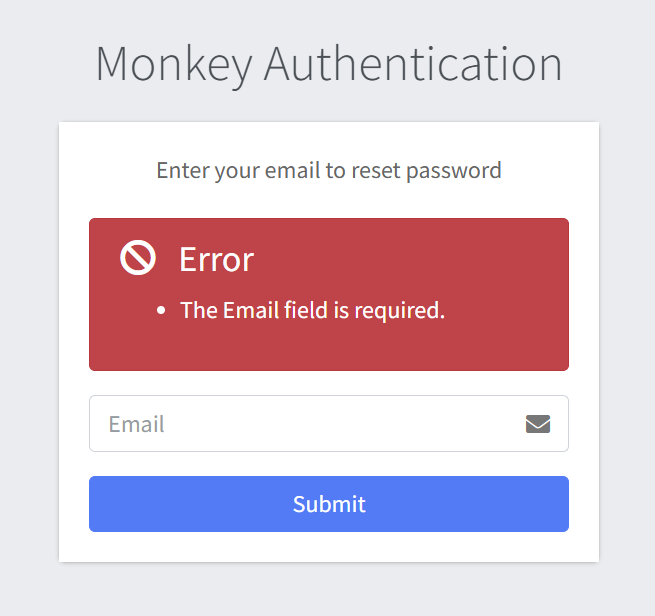
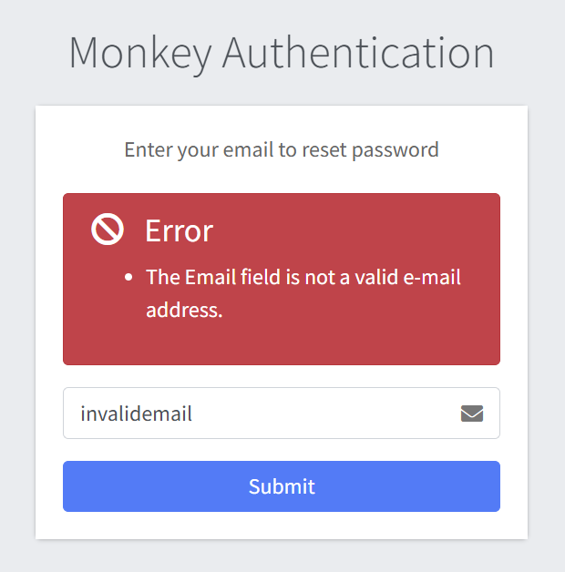
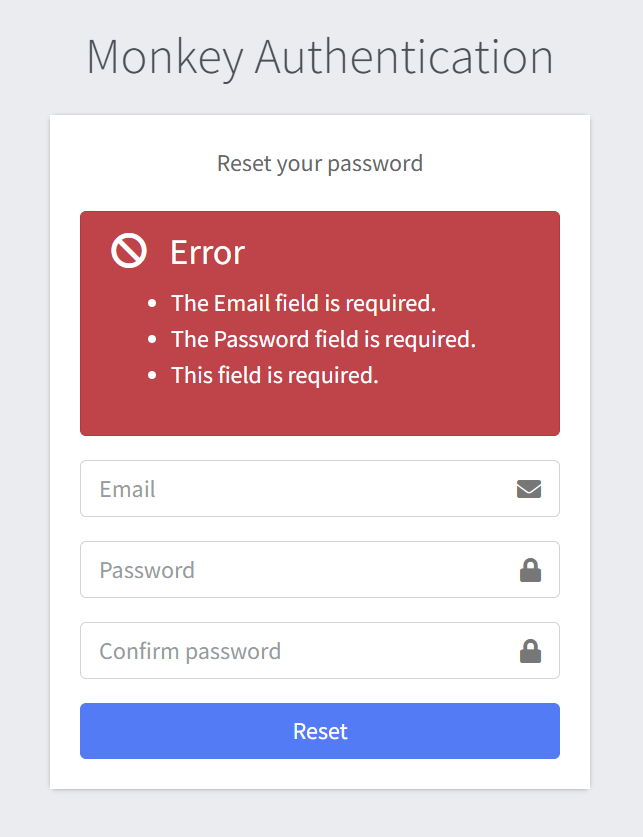

# Forgot Password

## Overview
Administrators can reset their password by submitting their registered email address. It's a secure method to regain account access if login credentials are forgotten.

## Steps to Reset Password

- Enter Your Email
  - Locate the input field on the page.
  - Enter the email associated with your admin account.

  

- Submit Request
  - Click the "Submit" button to initiate the password reset process.

  

- Check Your Email
  - A message will be sent to the provided email address with instructions to complete the password reset.

  

- Follow Reset Instructions
  - Click the link in the email and create a new secure password for your admin account.

  

## Error Handling
- An error is displayed above the Forgot password form if an empty form is submitted.

- An error is displayed above the Forgot password form if an invalid email address is submitted, but no error is shown if a non-existent email address is entered.

- An error is displayed above the Reset password form if an empty form is submitted.

## Best Practices
- Ensure your email inbox is accessible and check your spam folder if you don't see the reset email.
- For security, use a strong, unique password that you haven't used before.
