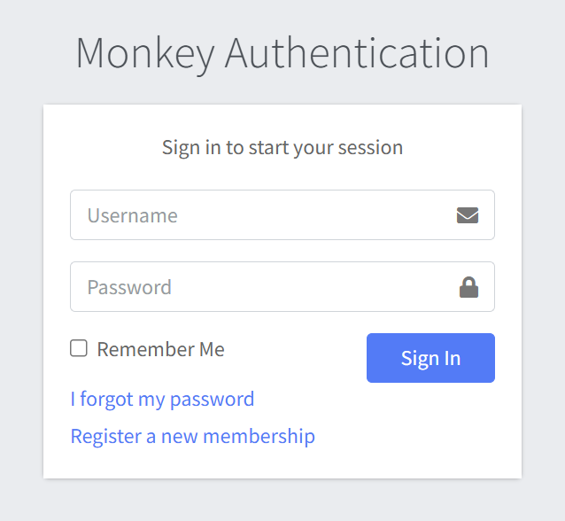
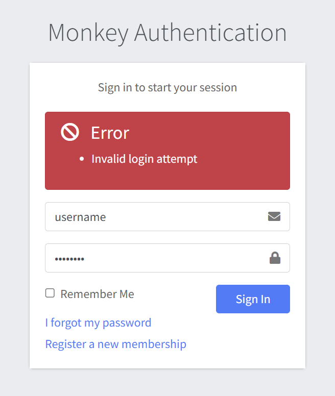
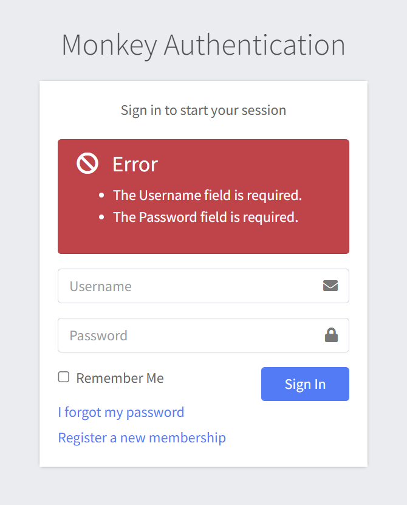

# Login

Logging into a Monkey Auth account is facilitated through standard authentication features, including error feedback, "Remember Me" functionality, and links to password recovery and new user registration.

## How to Use the Login Page

### 1. Login
- Email/Username & Password Fields: Enter your credentials in the provided input fields.
- Remember Me Checkbox: Select this option to stay signed in across sessions.
- Sign In Button: Click this to proceed with login.

### 2. Error Handling
- If the login fails (e.g., due to incorrect credentials), an error message will appear above the login form.

- An error is displayed above the Forgot password form if an empty form is submitted.

### 3. Forgot Password
- Click the "I forgot my password" link to initiate the password reset process.
- You'll be taken to a form where you can input your email to receive reset instructions.

### 4. Register a New Account
- Click "Register a new membership" to create a new MonkeyAuth account.
- Fill out the registration form on the linked page and follow prompts to complete setup.

## Best Practices
- Make sure your browser allows cookies and has JavaScript enabled.
- Use a secure and private device to log in.
- If you're using a shared or public computer, avoid using the "Remember Me" feature.
