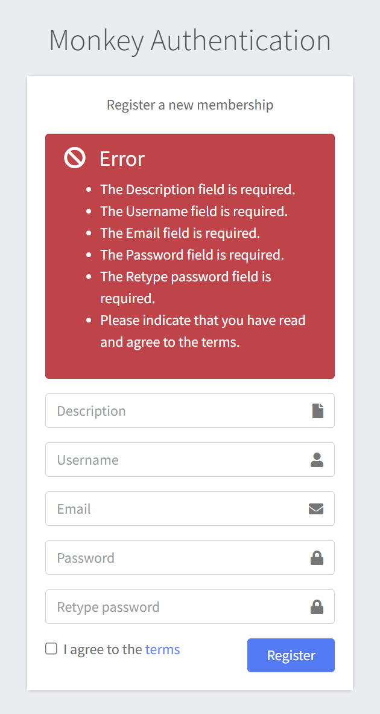

# Registration

## Overview
The Monkey Authentication system provides a user registration interface for creating new memberships. This document outlines the registration process and form fields.

## Registration Form
The registration interface consists of a simple form with the following fields:

### Form Fields
1. Description
   - Purpose: Allows users to provide a brief description of their account or purpose
   - Format: Text field
   - Requirements: Required

2. Username
   - Purpose: User's unique identifier in the system
   - Format: Text field
   - Requirements: Required, must be unique within the system

3. Email
   - Purpose: Primary contact method and potential recovery option
   - Format: Valid email address (example@domain.com)
   - Requirements: Required, must be properly formatted

4. Password
   - Purpose: Secure access credential
   - Format: Password field (masked input)
   - Requirements: Required, should follow secure password guidelines

5. Retype password
   - Purpose: Password confirmation to prevent typing errors
   - Format: Password field (masked input)
   - Requirements: Required, must match the entry in the Password field

6. Terms Agreement
   - Purpose: Confirmation that user accepts the terms of service
   - Format: Checkbox
   - Requirements: Must be checked to proceed with registration
   - Note: The terms are accessible via a hyperlink labeled "terms"

### Registration Process
1. Fill in all required fields in the form
2. Review and accept the terms of service by checking the checkbox
3. Click the "Register" button to submit your information
4. Upon successful submission, your membership will be created

## Error Handling
- An error is displayed above the Registration form if an empty form is submitted.

## Notes
- The "Monkey Auth" system likely provides authentication services for connected applications or services
- Form validation is performed before submission to ensure all requirements are met
- Users should ensure they use a secure, unique password and keep their credentials safe
