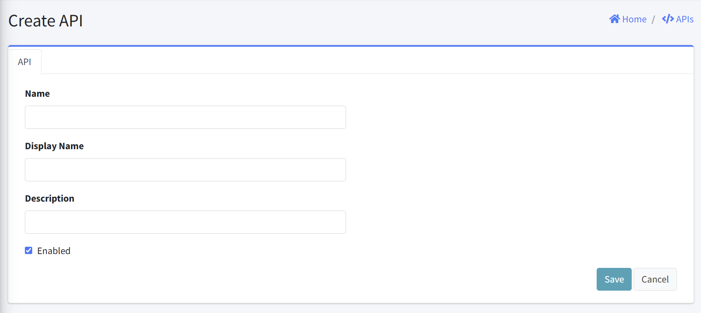
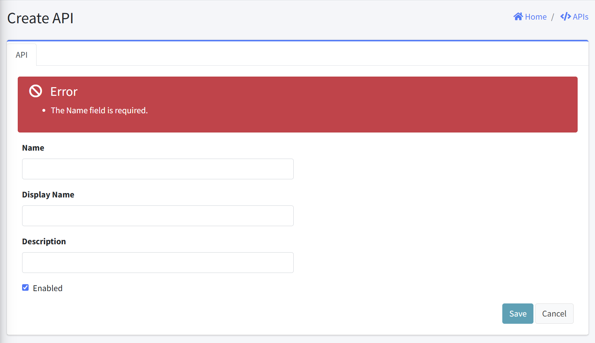

# Create API

This interface allows administrators to register a new API in the system. This document explains the interface elements, required fields, and proper usage of this feature.

## Form Fields
1. Name
  - Purpose: Unique identifier for the API
  - Format: Text field
  - Requirements: Required
  - Examples: "customer-api", "inventory_service"

2. Display Name
  - Purpose: User-friendly name for the API
  - Format: Text field
  - Requirements: Optional
  - Examples: "Customer Service API", "Inventory Management API"

3. Description
  - Purpoase: Brief explanation of API purpose and functionality
  - Format: Text field
  - Requirements: Optional
  - Example: "Provides secure access to customer information for mobile applications"

4. Enabled
  - Purpose: Activate/deactivate the API
  - Format: Checkbox

5. Action Buttons
  - Save: Submits the form and creates the new API
  - Cancel: Discards changes and returns to the APIs listing page

## Error Handling
- An error is displayed above the Create API form if an empty form is submitted.

## Notes

- All required fields should be completed before saving
- API name must be unique across the system
- API creation is typically the first step in a multi-step process
- After creating an API, additional configuration may be required:
  - Defining scopes
  - Granting access to appropriate clients
