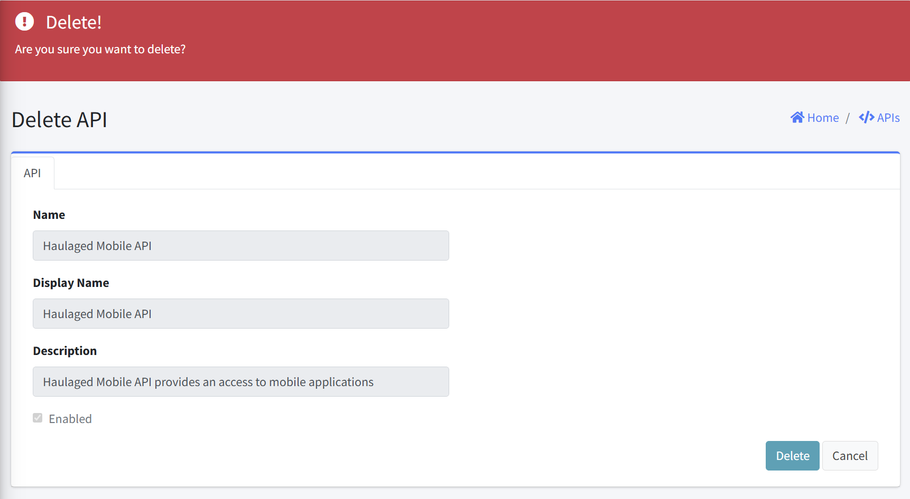

# Delete API

This interface allows administrators to permanently remove a API from the system. This document explains the purpose, interface elements, and proper usage of this feature.

## Form Fields

#### API Information Display (Read-Only)
The following API details are displayed for verification before deletion:

| Field | Description |
|-------|-------------|
| Name | Unique identifier for the API |
| Display Name | User-friendly name for the API |
| Description | Brief explanation of API purpose and functionality |

#### Action Controls
- Delete Button: Confirm and execute deletion
- Cancel Button: Abort the deletion process

### Notes

- Permanent Action: API deletion cannot be undone
- Service Impact: Any applications using this API will immediately lose access

### Post-Deletion Steps

After successfully deleting the API, consider the following next steps:
- Update any system documentation that references the deleted API
- Notify relevant stakeholders of the removal
- Reconfigure any dependent applications as needed
