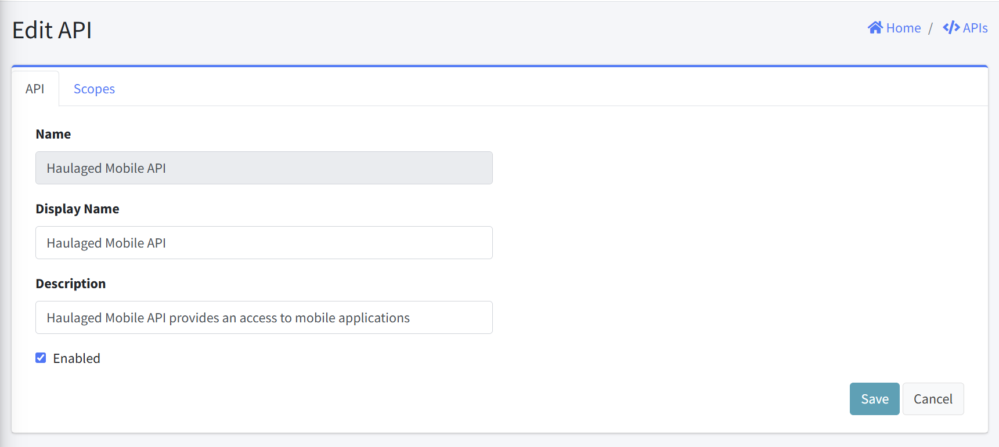

# Edit API

This interface allows administrators to modify existing API configurations. This form provides fields for updating API details.

## Form Fields
1. Name
  - Purpose: Unique identifier for the API
  - Format: Read-only text field
  - Value: Pre-filled with unique API name

2. Display Name
  - Purpose: User-friendly name for the API
  - Format: Text field
  - Requirements: Optional

3. Description
  - Purpoase: Brief explanation of API purpose and functionality
  - Format: Text field
  - Requirements: Optional

4. Enabled
  - Purpose: Activate/deactivate the API
  - Format: Checkbox

5. Action Buttons
  - Save: Submits the form and updates the API
  - Cancel: Discards changes and returns to the APIs listing page

## Notes

- Disabling an API will immediately prevent all clients from accessing it
- Updates to API information should be communicated to relevant stakeholders
- Consider the "Scopes" tab for managing specific permissions within the API

## Related Sections
An additional tab that are not currently active is included:
- [Scopes](APIEditScopes.html): Managing API scopes
