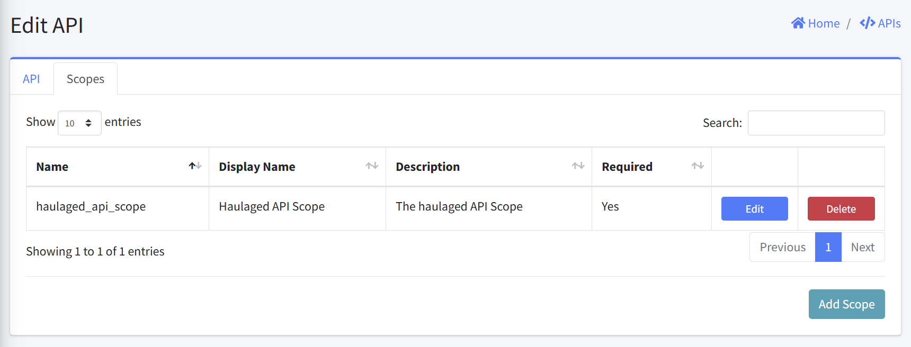
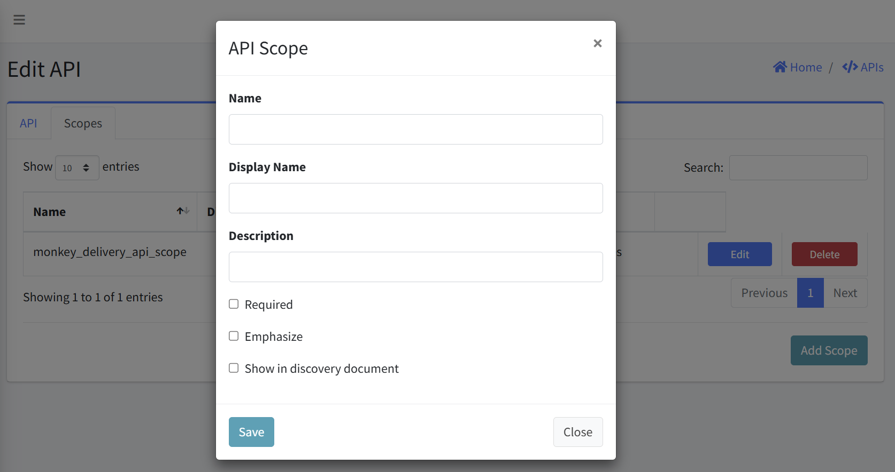
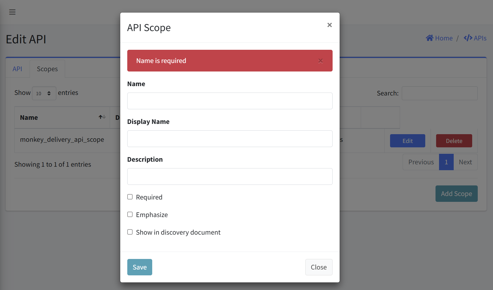
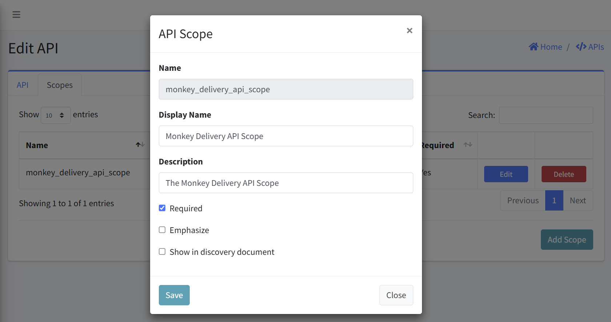
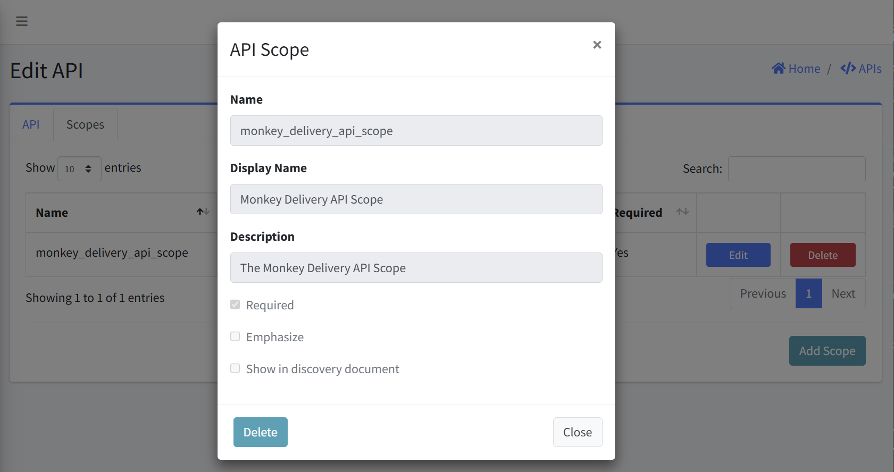

# API Scopes

API Scopes define the permissions and access levels that can be granted to clients using an API. This document explains both the Scopes management interface and the process for creating or editing individual API Scopes.

#### Navigation
- [Accessing the APIs](#accessing-the-api-scopes)
- [Viewing API Scopes](#viewing-api-scopes)
- [Adding a New API Scope](#adding-a-new-api-scope)
- [Editing Existing API Scope](#editing-existing-api-scope)
- [Deleting Existing API Scope](#deleting-existing-api-scope)
- [Field Guidelines](#field-guidelines)
- [Important Considerations](#important-considerations)
- [Security Best Practices](#security-best-practices)

## Accessing the API Scopes
1. Navigate to the APIs
2. Select the specific API from the APIs list
3. Click on the "Edit" option for the API
4. Within the Edit API interface, navigate to the "Scopes" tab

## Viewing API Scopes
The Scopes tab displays a table with the following columns:
- Name: Internal system identifier for the scope
- Display Name: User-friendly name shown in interfaces
- Description: Brief explanation of the scope's purpose
- Required: Indicates whether the scope is mandatory (Yes/No)
- Actions: Edit and Delete buttons for managing each scope

## Adding a New API Scope
1. From the Scopes tab, click "Add Scope" button in the bottom-right corner
2. An "API Scope" dialog will appear with the following fields:
   - Name: Enter a unique identifier, it is a required field
   - Display Name: Provide a user-friendly name
   - Description: Explain the purpose and access granted by this scope
   - Required: Check if this scope must be included in all API requests
   - Emphasize: Check to highlight this scope in consent screens
   - Show in discovery document: Check to include in the discovery document
4. Click "Save" to create the scope
5. Otherwise click "Close" to dismiss the form

### Error Handling
- An error is displayed above the API Scope form if an empty form is submitted.

## Editing Existing API Scope
1. Locate the scope you wish to edit in the API Scopes table
2. Click the "Edit" button in the Actions column
3. A "API Scope" dialog will appear with the current values pre-populated:
   - Name: A unique identifier, it is read-only field
   - Display Name: Modify the user-friendly name, if required
   - Description: Modify the purpose and access granted by this scope, if required
   - Required: Check if this scope must be included in all API requests
   - Emphasize: Check to highlight this scope in consent screens
   - Show in discovery document: Check to include in the discovery document
4. Click "Save" to apply your changes
5. Otherwise click "Close" to dismiss the form

## Deleting Existing API Scope
1. Locate the scope you wish to delete in the API Scopes table 
2. Click the "Delete" button in the Actions column
3. Confirm the deletion

## Field Guidelines

- Name:
  - Use lowercase with underscores for spaces
  - Be specific about the permission being granted
  - Examples: "read_user_data", "update_profile", "admin_access"

- Display Name:
  - Should be clear and concise
  - Use proper capitalization
  - Examples: "Read User Data", "Update Profile", "Administrative Access"

- Description:
  - Clearly explain what access is granted by this scope
  - Include details about accessible resources or operations
  - Examples: "Allows reading basic user information", "Grants access to update user profile"

## Important Considerations

- Scope Design: 
  - Follow the principle of least privilege
  - Create granular scopes for different levels of access
  - Consider how scopes will be combined in client applications

- Required Scopes:
  - Only mark scopes as required if they are essential for the API to function
  - Required scopes are automatically granted during client authorization

- Scope Changes:
  - Modifying existing scopes may affect client applications
  - Removing scopes can break existing integrations
  - Consider deprecating rather than deleting widely-used scopes

## Security Best Practices

- Create separate scopes for read and write operations
- Use clear naming conventions that indicate the level of access
- Document all scopes thoroughly for developers
- Review scope assignments regularly to ensure proper access control
- Consider the impact of scope combinations when designing the permission model
