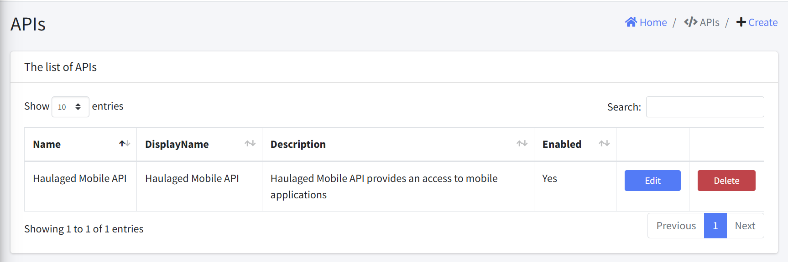

# APIs

APIs can be viewed, created, edited, and deleted through this interface.

The APIs interface consists of the following components:

### Header
- Page Title: "APIs" title at the top
- Breadcrumb: Home > APIs
- Create Button: Add a new API

### APIs Table
The table displays APIs with the following columns:

| Column | Description | Sortable |
|--------|-------------|----------|
| Name | Internal system identifier for the API | Yes |
| DisplayName | User-friendly name shown in interfaces | Yes |
| Description | Brief explanation of API purpose and functionality | Yes |
| Enabled | Indicates whether the API is active (Yes/No) | Yes |
| Actions | Edit and Delete buttons for each API | No |

### Controls
- Show entries: Dropdown to select number of records per page
- Search: Filter records based on any field
- Pagination: Navigate through multiple pages of results

## Key Functionality
1. View APIs in a tabular format
2. Sort by clicking column headers
3. Search to filter specific APIs
4. Paginate through results
5. Create a new API
6. Edit existing API
7. Delete existing API

## Notes
- Deleting an API will remove access for all applications using that API
- Disabling an API (changing Enabled to "No") temporarily prevents access without deletion
- API names must be unique within the system
- Search functionality typically applies across all visible columns
