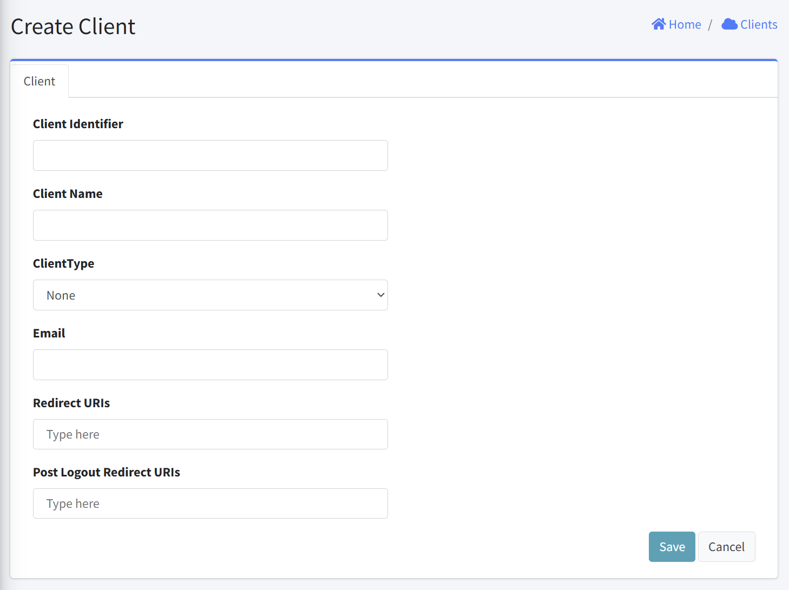
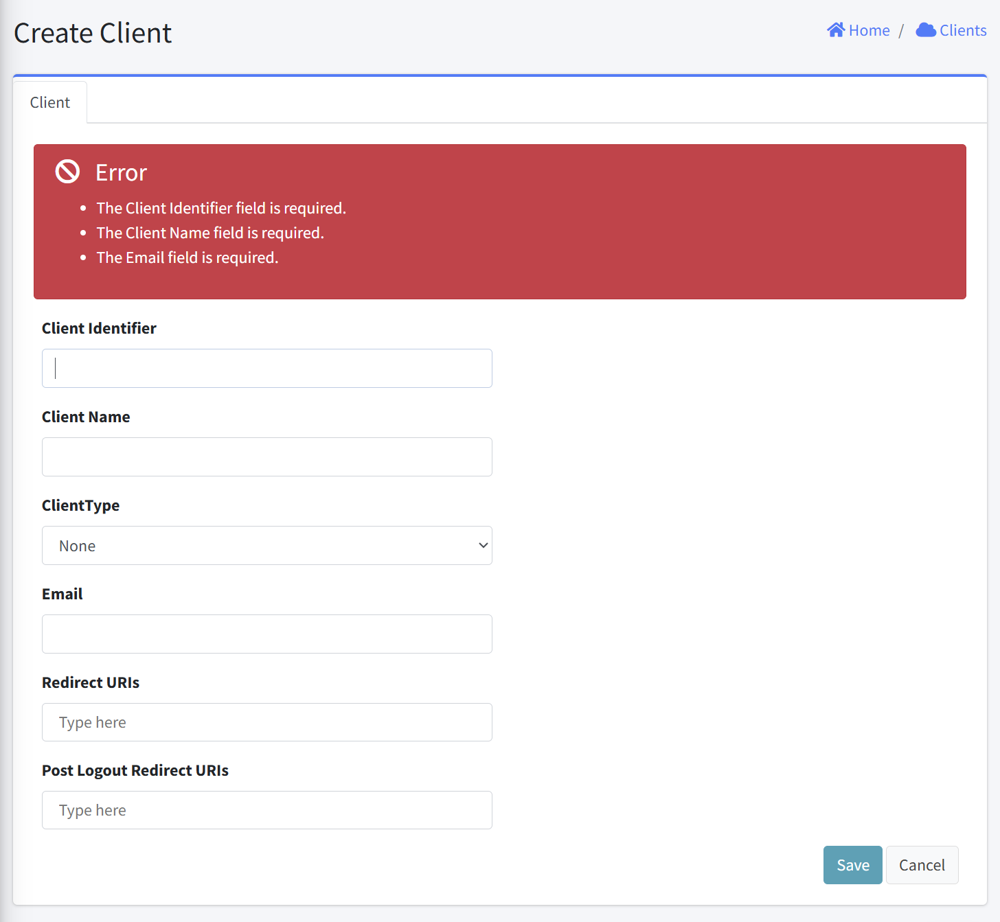

# Create Client

This interface allows administrators to register a new client application in the system. This form collects essential information needed to establish a client profile and configure its authentication parameters.

## Form Fields
1. Client Identifier
   - Purpose: Unique identifier for the client application
   - Format: Text field
   - Requirements: Required
   
2. Client Name
   - Purpose: Descriptive name for the client application
   - Format: Text field
   - Requirements: Required
   
3. ClientType
   - Purpose: Classifies the type of client application
   - Format: Dropdown selection
   - Default value: "None"

4. Email
   - Purpose: Contact email address for the client administrator
   - Format: Text field
   - Requirements: Required, must be properly formatted

5. Redirect URIs
   - Purpose: URLs where users will be redirected after authentication
   - Format: Multi-value field with tag-like entries
   - Placeholder text: "Type here"
   
6. Post Logout Redirect URIs
   - Purpose: URLs where users will be redirected after logging out
   - Format: Multi-value field with tag-like entries
   - Placeholder text: "Type here"

7. Action Buttons
   - Save: Submits the form and creates the client
   - Cancel: Discards changes and returns to the Clients listing page

## Error Handling
- An error is displayed above the Create Client form if an empty form is submitted.

## Notes
- All required fields should be completed before saving
- Client Identifier must be unique across the system
- Redirect URIs are critical for proper OAuth/OpenID Connect flows
- Multiple redirect URIs can likely be entered (implementation specific)
