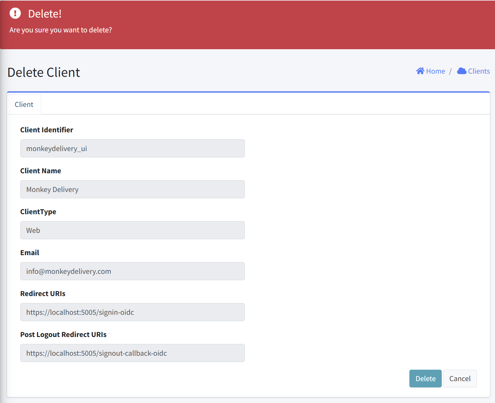

# Delete Client

This interface allows administrators to permanently remove a client from the system. This document explains the purpose, interface elements, and proper usage of this feature.

## Form Fields

#### Client Information Display (Read-Only)
The following client details are displayed for verification before deletion:

| Field | Description |
|-------|-------------|
| Client Identifier | Unique client identifier |
| Client Name | Client descriptive name |
| ClientType | Type of client application |
| Email | Associated email address |
| Redirect URIs | Authentication redirect paths |
| Post Logout Redirect URIs | Post-logout redirect paths |

#### Action Controls
- Delete Button: Confirm and execute deletion
- Cancel Button: Abort the deletion process

### Usage Instructions

1. Access: Navigate to the Delete Client page from the Clients page
2. Review: Carefully verify all client information to ensure you're deleting the correct client
3. Confirm: Click "Delete" button to permanently delete the client
4. Abort: Click "Cancel" to exit without making changes

### Notes

- Permanent Action: Client deletion cannot be undone
- Service Impact: Any applications using this client for authentication will immediately lose access

### Post-Deletion Steps

After successfully deleting a client, consider the following next steps:
- Update any system documentation that references the deleted client
- Notify relevant stakeholders of the removal
- Reconfigure any dependent applications as needed
