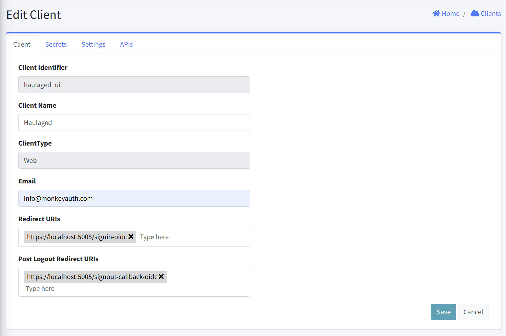

# Edit Client

This interface allows administrators to modify existing client application details. This form provides fields for updating client information, authentication redirect URIs, and associated contact details.

## Form Fields
1. Client Identifier
   - Purpose: Unique identifier for the client application
   - Format: Read-only text field
   - Value: Pre-filled with client application unique identifier

2. Client Name
   - Purpose: Descriptive name for the client application
   - Format: Text field
   - Requirements: Required

3. ClientType
   - Purpose: Classifies the type of client application
   - Format: Dropdown selection

4. Email
   - Purpose: Contact email address for the client administrator
   - Format: Text field
   - Requirements: Required, must be properly formatted

5. Redirect URIs
   - Purpose: URLs where users will be redirected after authentication
   - Format: Multi-value field with tag-like entries

6. Post Logout Redirect URIs
   - Purpose: URLs where users will be redirected after logging out
   - Format: Multi-value field with tag-like entries

7. Action Buttons
   - Save: Submits the form and updates the client
   - Cancel: Discards changes and returns to the Clients listing page

## Related Sections
Three additional tabs that are not currently active are included:
- [Secrets](ClientEditSecrets.html): Managing client secrets
- [Settings](ClientEditSettings.html): Additional client configuration options
- [APIs](ClientEditAPIs.html): API access configuration for the client
