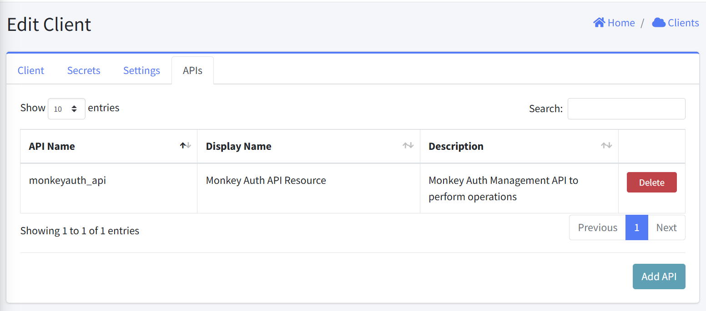
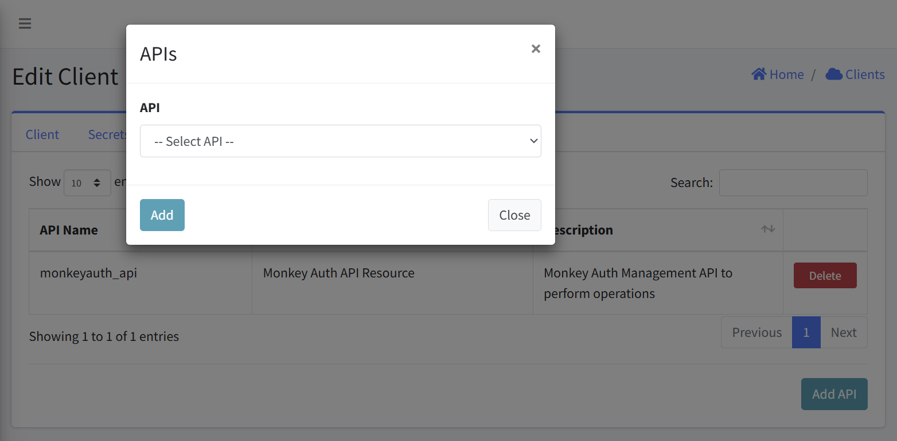
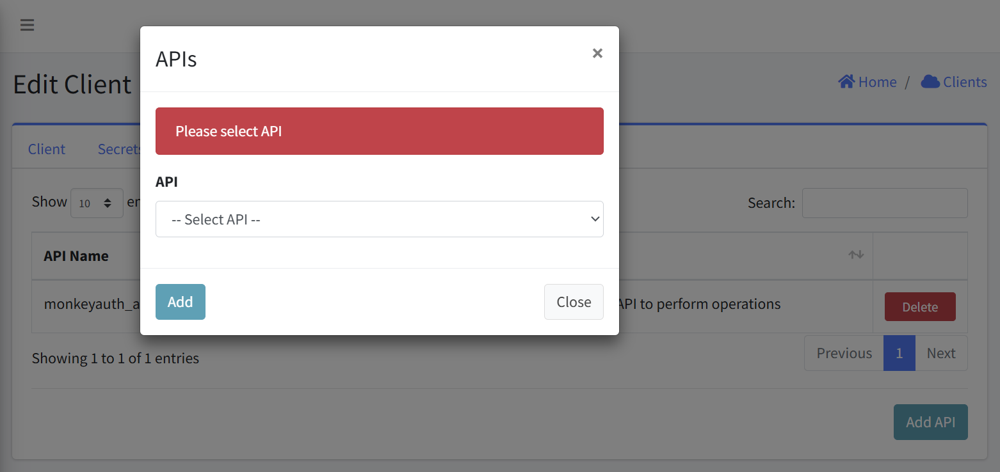
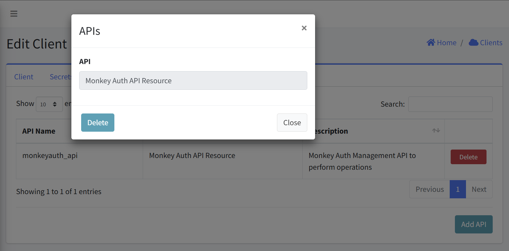

# Client APIs

This interface allows you to configure, view, and manage APIs associated with client application. This documentation covers all the key functions and workflows for managing these APIs.

#### Navigation
- [Accessing Client APIs](#accessing-client-apis)
- [Viewing APIs](#viewing-apis)
- [Adding an API](#adding-an-api)
- [Removing an API](#removing-an-api)

## Accessing Client APIs
1. Navigate to the Client management section
2. Select the specific client from the clients list
3. Click on the "Edit Client" option
4. Within the Edit Client interface, navigate to the "APIs" tab

## Viewing APIs
The APIs tab displays a table with the following columns:
- API Name: The internal identifier used for the API resource
- Display Name: The user-friendly name for the API resource
- Description: Details about the API's purpose and functionality
- Actions: Delete button for removing the API connection

## Adding an API
1. From the APIs tab, click the "Add API" button in the bottom-right corner
2. An "APIs" dialog will appear with a dropdown field labeled "API"
3. Select the desired API from the dropdown list (e.g., "-- Select API --")
4. Click "Add" to associate the selected API with the client
5. The new API connection will appear in the API resources table

### Error Handling
- An error is displayed above the Add API form if an empty form is submitted.

## Removing an API
1. Locate the API you wish to delete
2. Click the "Delete" button in the Actions column (right side)
3. Confirm the deletion

## Notes
- Only add API that the client explicitly needs to function
- Regularly review APIs to ensure they're still required
- Consider security implications when granting access to sensitive APIs
- Use descriptive API names that clearly indicate their purpose
