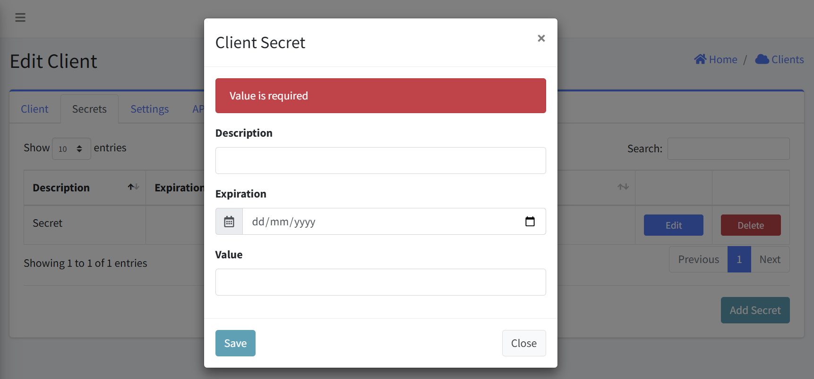
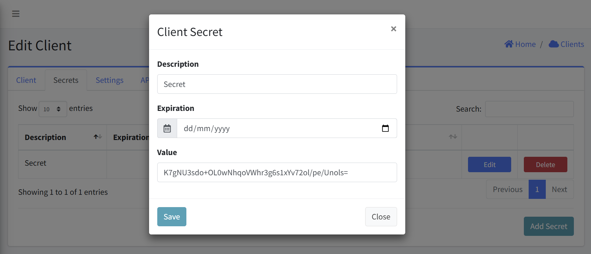

# Client Secrets

This interface allows to create, view, edit, and delete secrets associated with client application. This documentation covers all the key functions and workflows for managing these sensitive credentials.

#### Navigation
- [Accessing the Client Secrets](#accessing-the-client-secrets)
- [Viewing Client Secrets](#viewing-client-secrets)
- [Adding a New Secret](#adding-a-new-secret)
- [Editing Existing Secrets](#editing-existing-secrets)
- [Deleting Secrets](#deleting-secrets)
- [Setting Expiration Dates](#setting-expiration-dates)

## Accessing the Client Secrets
1. Navigate to the Clients
2. Select the specific client from the clients list
3. Click on the "Edit Client" option
4. Within the Edit Client interface, navigate to the "Secrets" tab

## Viewing Client Secrets
The Secrets tab displays a table with the following columns:
- Description: A user-friendly name or purpose for the secret
- Expiration: The date when the secret expires (if configured)
- Value: The actual secret value (usually displayed in an encoded format)
- Actions: Edit and Delete buttons for managing each secret

## Adding a New Secret
1. From the Secrets tab, click the "Add Secret" button in the bottom-right corner
2. A "Client Secret" dialog will appear with the following fields:
   - Description: Enter a meaningful name or purpose for the secret
   - Expiration: Set an optional expiration date in DD/MM/YYYY format
   - Value: Enter the secret value or leave blank to generate one automatically
3. Click "Save" to create the new secret

### Error Handling
- An error is displayed above the Add API form if an empty form is submitted.

## Editing Existing Secrets
1. Locate the secret you wish to edit in the secrets table
2. Click the "Edit" button in the Actions column
3. A "Client Secret" dialog will appear with the current values pre-populated:
   - Description: Update if needed
   - Expiration: Modify or set an expiration date
   - Value: The current secret value is displayed and can be modified
4. Click "Save" to apply your changes

## Deleting Secrets
1. Locate the secret you wish to delete
2. Click the "Delete" button in the Actions column
3. Confirm the deletion

## Setting Expiration Dates
1. When creating or editing a secret, use the date picker field labeled "Expiration"
2. Click the calendar icon to open a date selection interface
3. Select the desired expiration date in DD/MM/YYYY format
4. Leaving this field empty means the secret will not expire automatically
