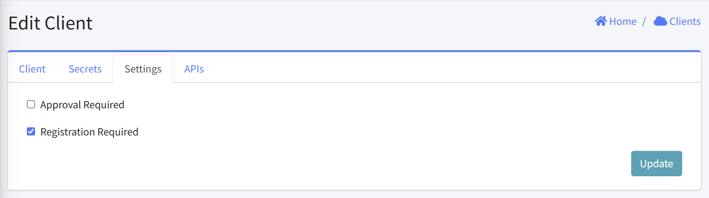

# Client Settings

This interface allows to update authentication and access requirements.

### Approval Required
When enabled, this setting requires an administrator to manually approve the user before they can use the system. This provides an additional layer of control over who can access the system.

- Default: Unchecked (off)
- Use case: Enable this for sensitive applications where you need to verify each user before granting access.

### Registration Required
When enabled, a user can self register before accessing the system.

- Default: Checked (on)
- Use case: Enable this to allow user to self register.

### Updating Settings

After making changes to the settings, click the "Update" button in the bottom right corner to save your changes.
