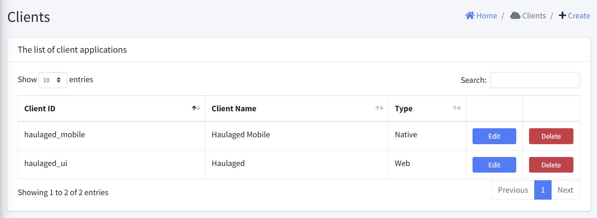

# Clients

Client applications can be viewed, created, edited, and deleted through this interface.

The clients interface consists of the following components:

### Header
- Title: "Clients" title at the top
- Breadcrumb: Home > Clients
- Create Button: Add a new client application

### Clients Table
The main table displays client applications with the following columns:
- Client ID: Unique identifier (sortable)
- Client Name: Name of the client (sortable)
- Type: Application type (sortable)

### Controls
- Show entries: Dropdown to select number of records per page
- Search: Filter records based on any field
- Pagination: Navigate through multiple pages of results
- Action Buttons: 
  - Edit: Modify client details
  - Delete: Remove client from the system

## Key Functionality
1. View clients in a tabular format
2. Sort by clicking column headers
3. Search to filter specific clients
4. Paginate through results
5. Create a new client application
6. Edit existing client details
7. Delete existing client

## User Workflow
1. Access the Clients page
2. View existing clients in the table
3. Use search to find specific clients
4. Select number of entries to display
5. Create a new client using the Create button
6. Edit or delete clients using row action buttons
7. Navigate between pages using pagination controls
