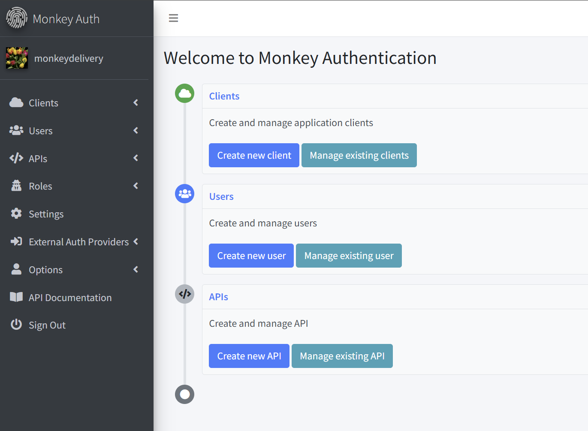

# Admin

The Monkey Auth dashboard is the central management interface for configuring and managing your authentication services. This dashboard provides access to clients, users, APIs, roles, settings, and external authentication providers.

## Dashboard Layout
The dashboard consists of a sidebar navigation menu on the left and a main content area on the right.

### Header
- Logo: Monkey Auth logo in the top-left corner
- Menu Toggle: Button to collapse/expand the sidebar
- Home: Navigate to the Admin home page

### Sidebar Navigation
The sidebar contains the following sections:

1. Clients
   - List: View all clients
   - Create: Add a new client

2. Users
   - List: View all users
   - Create: Add a new user

3. APIs
   - List: View all APIs
   - Create: Create a new API

4. Roles
   - List: View all roles
   - Create: Create a new role

5. Settings
   - Access system settings

6. External Auth Providers
   - List: View external authentication providers
   - Create: Configure a new external provider

7. Options
   - Change Password: Update your account password
   - Two Factor Auth (2FA): Configure two-factor authentication

8. API Documentation: Access API reference documentation

9. Sign Out: Log out from the Admin area

## Main Dashboard Sections

### Welcome Screen
The main welcome screen displays the following sections:

1. Clients Section
   - Description: Create and manage application clients
   - Actions:
     - Create new client: Register a new application
     - Manage existing clients: View and edit registered clients

2. Users Section
   - Description: Create and manage users
   - Actions:
     - Create new user: Add a new user to the system
     - Manage existing user: View and edit user accounts

3. APIs Section
   - Description: Create and manage API
   - Actions:
     - Create new API: Configure a new API endpoint
     - Manage existing API: View and edit API configurations
