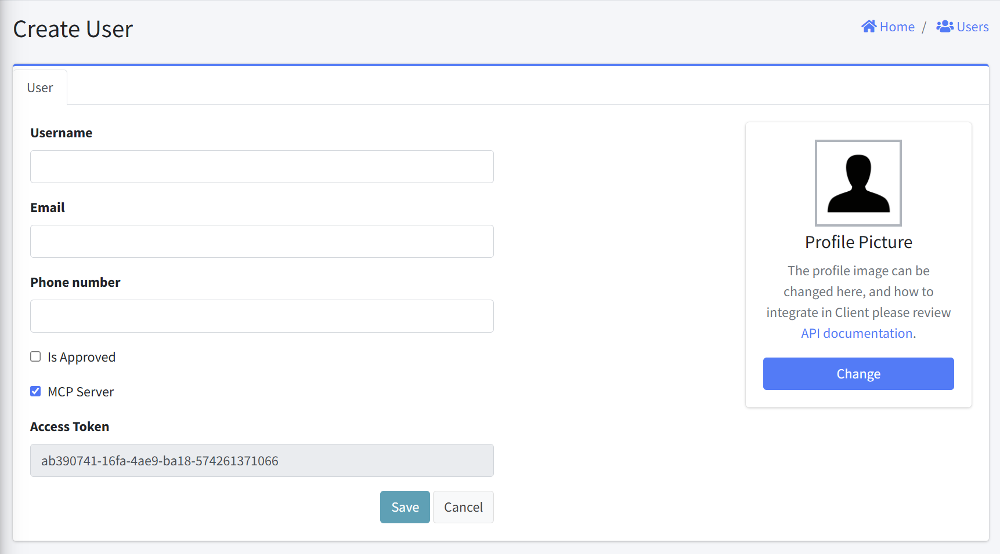
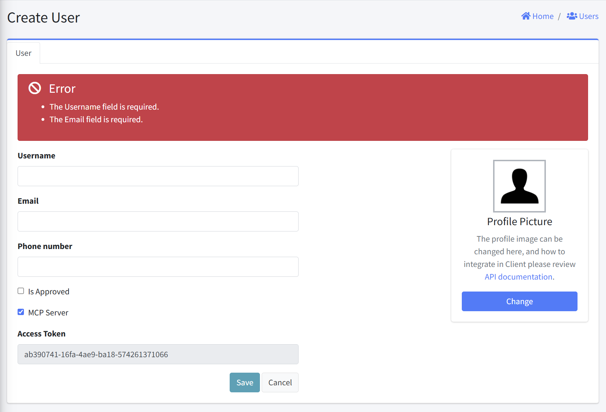

# Create User

This interface allows administrators to create a new user in the system. This form collects essential information needed to create a user and configure its authentication parameters.

## Form Fields
1. Username
   - User's login identifier and it must be unique in the system
   - Format: Text field
   - Requirements: Required

2. Email
   - User's email address and it is used for notifications and account recovery
   - Format: Text field
   - Requirements: Required

3. Phone number
   - User's contact number
   - Format: Text field
   - Requirements: Optional

4. Is Approved
   - Account Status: When selected, the user is granted immediate access to the system, unless the global setting "Approval Required" is enabled — in that case, access is only granted after approval.
   - Format: Checkbox

5. MCP Server
   - Enable this to allow AI assistants—such as Claude, GitHub Copilot, and others—to interact with the system via the MCP (Model Context Protocol) Server.
   - Format: Checkbox

6. Access Token
   - When the MCP Server option is enabled, a read-only text field displays an auto-generated access token for connecting to the MCP Server.
   - Format: Read-only text field

5. Action Buttons
   - Save: To create the new user account
   - Cancel: To abort the user creation process

## Error Handling
- An error is displayed above the Create User form if an empty form is submitted.

## Notes
- All required fields should be completed before saving
- Username must be unique across the system
- If “Is Approved” is not checked, administrators may need to manually approve the account later
