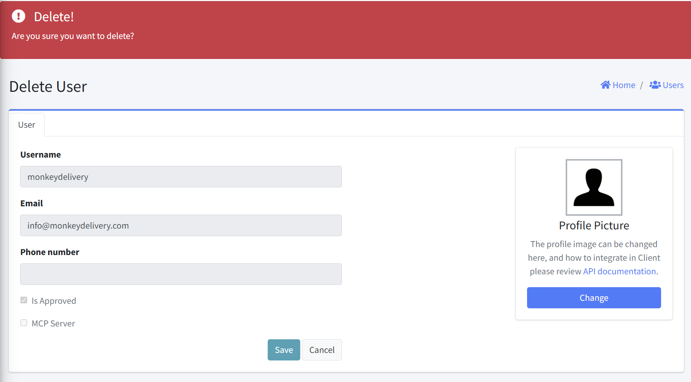

# Delete User

This interface allows administrators to permanently remove a user from the system. This document explains the purpose, interface elements, and proper usage of this feature.

## Form Fields

#### User Information Display (Read-Only)
The following user details are displayed for verification before deletion:

| Field | Description |
|-------|-------------|
| Username | User's login identifier |
| Email | User's email address |
| Phone number | User's contact number |
| Is Approved | Account status checkbox |
| MCP Server | MCP Server's status checkbox |
| Access Token | MCP Server's access token if MCP Server is enabled |

#### Action Controls
- Delete Button: Confirm and execute deletion
- Cancel Button: Abort the deletion process

### Notes
- User deletion is typically permanent and cannot be undone
- Consider reviewing dependent resources before user deletion
- For security reasons, the system prevents administrators from deleting their own accounts while logged in
- Consider deactivating the user account by unchecking "Is Approved" from the Edit User page
