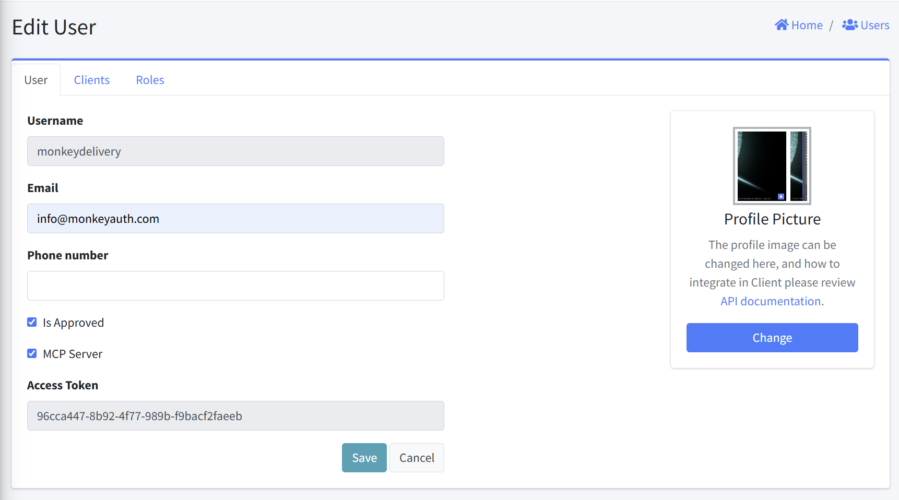

# Edit User

This interface allows administrators to modify existing user details. This form provides fields for updating user contact details, approval, MCP (Model Context Protocol) Server access, and associated clients and roles.

## Form Fields
1. Username
   - Purpose: User's login identifier
   - Format: Read-only text field
   - Value: Pre-filled with user's username

2. Email
   - Purpose: User's email address
   - Format: Text field
   - Requirements: Required

3. Phone number
   - Purpose: User's contact number
   - Format: Text field

4. Is Approved
   - Purpose: When selected, the user is granted immediate access to the system, unless the global setting "Approval Required" is enabled — in that case, access is only granted after approval.
   - Format: Checkbox

5. MCP Server
   - Purpose: Enable this to allow AI assistants—such as Claude, GitHub Copilot, and others—to interact with the system via the MCP (Model Context Protocol) Server.
   - Format: Checkbox

6. Access Token
   - Purpose: When the MCP Server option is enabled, a read-only text field displays an auto-generated access token for connecting to the MCP Server.
   - Format: Read-only text field

7. Action Buttons
   - Save: Submits the form and updates the user details
   - Cancel: Discards changes and returns to the Users listing page

## Notes

- Modifying approval status and MCP Server access directly affects system access

## Related Sections
Two additional tabs that are not currently active are included:
- [Clients](UserEditClients.html): Clients access configuration for the user
- [Roles](ClientEditRoles.html): Manage roles assigned to the user
