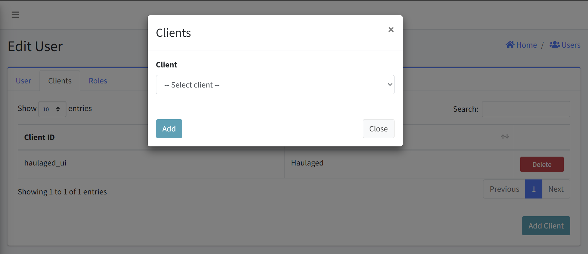
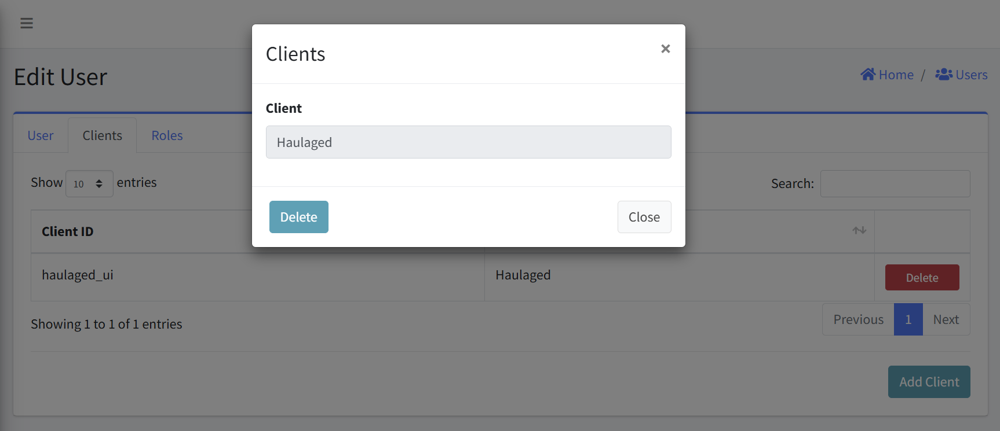

# User Clients

This interface allows you to configure, view, and manage Clients associated with user. This documentation covers all the key functions and workflows for managing these Clients.

#### Navigation
- [Accessing User Clients](#accessing-user-clients)
- [Viewing Clients](#viewing-clients)
- [Adding a Client](#adding-a-client)
- [Removing a Client](#removing-a-client)

## Accessing User Clients
1. Navigate to the User management section
2. Select the specific user from the users list
3. Click on the "Edit User" option
4. Within the Edit User interface, navigate to the "Clients" tab

## Viewing Clients
The Clients tab displays a table with the following columns:
- Client ID: The internal identifier used for the Client
- Name: The user-friendly name for the Client
- Actions: Delete button for removing the Client connection

## Adding a Client
1. From the Clients tab, click the "Add Client" button in the bottom-right corner
2. A "Clients" dialog will appear with a dropdown field labeled "Client"
3. Select the desired Client from the dropdown list
4. Click "Add" to associate the selected Client with the user
5. The new Client connection will appear in the Clients table

### Error Handling
- An error is displayed above the Add Client form if an empty form is submitted.

## Removing a Client
1. Locate the Client you wish to delete
2. Click the "Delete" button in the Actions column (right side)
3. Confirm the deletion

## Notes
- Only add Client that the user explicitly needs
- Regularly review Clients to ensure they're still required
