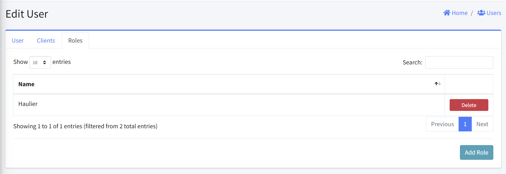
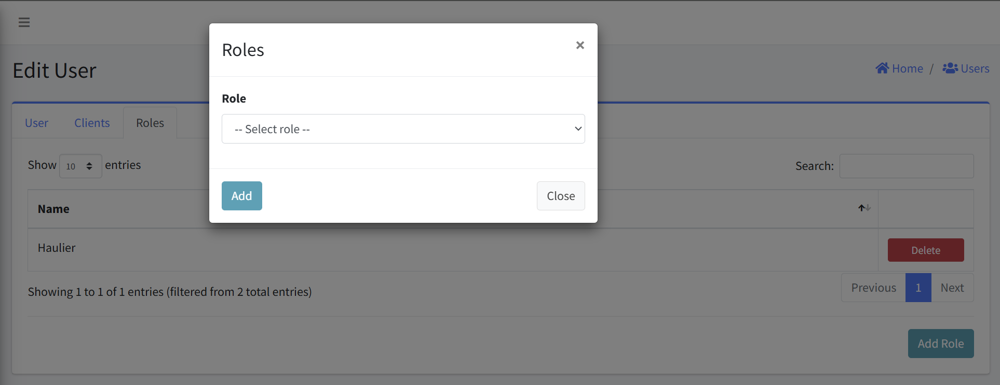
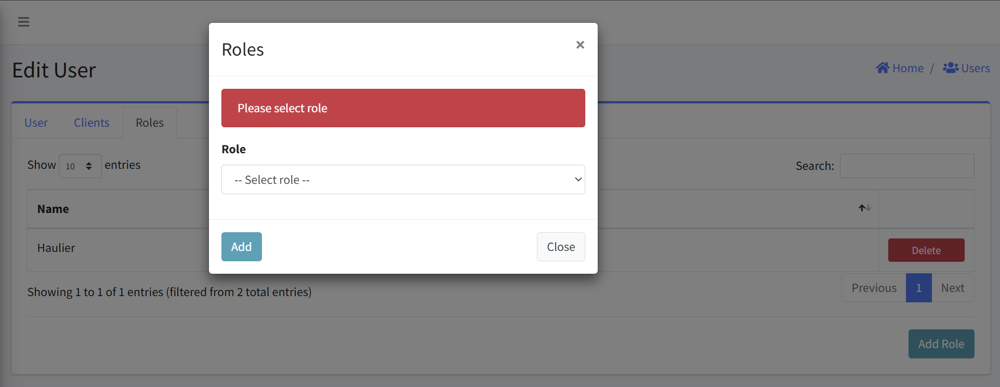
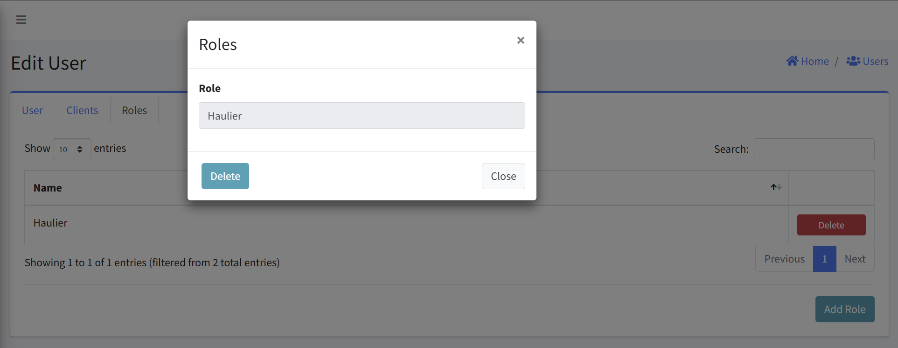

# User Roles

This interface allows you to configure, view, and manage Roles associated with user. This documentation covers all the key functions and workflows for managing these Roles.

#### Navigation
- [Accessing User Roles](#accessing-user-roles)
- [Viewing Roles](#viewing-roles)
- [Adding a Role](#adding-a-role)
- [Removing a Role](#removing-a-role)

## Accessing User Roles
1. Navigate to the User management section
2. Select the specific user from the users list
3. Click on the "Edit User" option
4. Within the Edit User interface, navigate to the "Roles" tab

## Viewing Roles
The Roles tab displays a table with the following columns:
- Name: The user-friendly name for the Role
- Actions: Delete button for removing the Role association

## Adding a Role
1. From the Roles tab, click the "Add Role" button in the bottom-right corner
2. A "Roles" dialog will appear with a dropdown field labeled "Role"
3. Select the desired Role from the dropdown list
4. Click "Add" to associate the selected Role with the user
5. The new Role association will appear in the Roles table

### Error Handling
- An error is displayed above the Add Role form if an empty form is submitted.

## Removing a Role
1. Locate the Role you wish to delete
2. Click the "Delete" button in the Actions column (right side)
3. Confirm the deletion

## Notes
- Only add Role that the user explicitly needs
- Regularly review Roles to ensure they're still required
