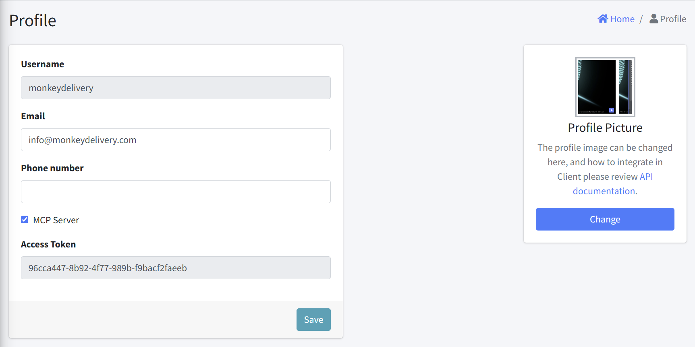

# User Profile

## Overview
The User Profile page allows users to view and update their personal information including email address, phone number, and profile picture. This page is part of the user settings module and helps users manage their account details.

### User Information Form (Left Panel)
1. Username
   - Type: Read-only
   - Value: Pre-filled with username
  
2. Email
   - Type: Editable text field
   - Value: User's current email address
   - Requirements: Required

3. Phone number
   - Type: Editable text field
   - Value: Empty by default unless previously saved
   - Requirements: Optional

4. Save Button
   - Action: Saves changes made to the Email and Phone Number fields

### Profile Picture Form (Right Panel)
1. Image Preview: Displays the current profile picture
2. Label: "Profile Picture"
3. Instructions:
   > The profile image can be changed here, and how to integrate in Client please review [API documentation](#).
4. Change Button
   - Action: Triggers image selection/upload functionality

## Error Handling
- An error is displayed above the User Profile form if an empty form is submitted.

