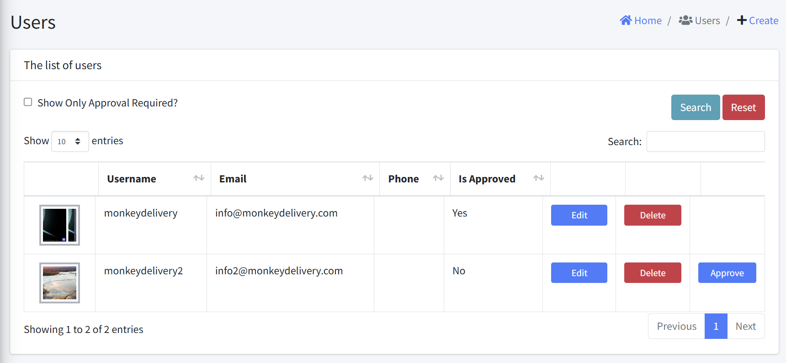

# Users

Users can be viewed, created, edited, and deleted through this interface.

The users interface consists of the following components:

### Header
- Title: "Users" title at the top
- Breadcrumb: Home > Users
- Create Button: Add a new user

### Users Table
The table displays users information with the following columns:

| Column | Description | Sortable |
|--------|-------------|----------|
| User Image | User's profile image | No |
| Username | User's login name | Yes |
| Email | User's email address | Yes |
| Phone | User's contact number | Yes |
| Is Approved | User account approval status | Yes |
| Actions | Edit, Delete, and Approve button for each user | No |

### Filters and Controls
- Show Only Approval Required?: Checkbox to filter users pending approval
- Show entries: Dropdown to select number of records per page
- Search: Filter records based on any field
- Search/Reset Buttons: Controls to apply or clear search filters
- Pagination: Navigate through multiple pages of results

## Key Functionality
1. View users in a tabular format
2. Filter users pending approval
3. Sort by clicking column headers
4. Search to find specific users
5. Reset search filters
7. Create a new user
8. Edit existing user details
9. Delete existing user
10. Approve pending user
